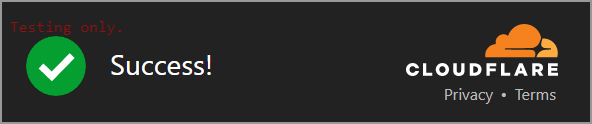

<div align="center">
 <h1>React Turnstile</h1>
 
 <p><a href="https://developers.cloudflare.com/turnstile/">Cloudflare Turnstile</a> integration for React.</p>
 <a href="https://npm.im/@marsidev/react-turnstile">
  
 </a>
 <a href="https://npm.im/@marsidev/react-turnstile">
  
 </a>
 <a href="https://packagephobia.com/result?p=@marsidev/react-turnstile">
  
 </a>
 <a href="https://bundlephobia.com/package/@marsidev/react-turnstile">
  
 </a>
 <a href="https://github.com/marsidev/react-turnstile/actions/workflows/ci.yml"></a>
 
 
</div>

<!-- vscode-markdown-toc -->
# Table of contents

* 1. [Features](#Features)
* 2. [Demo](#Demo)
* 3. [Install](#Install)
* 4. [Usage](#Usage)
* 5. [Props](#Props)
  * 5.1. [Render options](#Renderoptions)
  * 5.2. [Script options](#Scriptoptions)
* 6. [Examples](#Examples)
  * 6.1. [Rendering the widget](#Renderingthewidget)
  * 6.2. [Rendering the widget with custom props](#Renderingthewidgetwithcustomprops)
  * 6.3. [Managing widget rendering status](#Managingwidgetrenderingstatus)
  * 6.4. [Getting the token after solving the challenge](#Gettingthetokenaftersolvingthechallenge)
  * 6.5. [Interacting with the widget](#Interactingwiththewidget)
  * 6.6. [Interacting with the widget (using TypeScript)](#InteractingwiththewidgetusingTypeScript)
  * 6.7. [Validating a token](#Validatingatoken)
  * 6.8. [Handling widget expiring](#Handlingwidgetexpiring)
* 7. [Contributing](#Contributing)
* 8. [Development](#Development)
* 9. [Credits](#Credits)
* 10. [License](#License)

<!-- vscode-markdown-toc-config
	numbering=true
	autoSave=true
	/vscode-markdown-toc-config -->
<!-- /vscode-markdown-toc -->

## <a name='Features'></a>Features

* 💪 smart verification with minimal user interaction
* 🕵️‍♀️ privacy-focused approach
* 💉 automatic script injection
* ⚡️ ssr ready

## <a name='Demo'></a>Demo

<https://react-turnstile.vercel.app/>

## <a name='Install'></a>Install

1. [Follow these steps](https://developers.cloudflare.com/turnstile/get-started/) to obtain a free site key and secret key from Cloudflare.
2. Install `@marsidev/react-turnstile` into your React project.

 ```bash
 npm i @marsidev/react-turnstile
 ```

 Or using any custom package manager:

 ```bash
 pnpm add @marsidev/react-turnstile
 ```

 ```bash
 yarn add @marsidev/react-turnstile
 ```

 ```bash
 bun add @marsidev/react-turnstile
 ```

 ```bash
 ni @marsidev/react-turnstile
 ```

## <a name='Usage'></a>Usage

The only required prop is the `siteKey`.

```jsx
import { Turnstile } from '@marsidev/react-turnstile'

function Widget() {
  return <Turnstile siteKey='1x00000000000000000000AA' />
}
```

## <a name='Props'></a>Props

| **Prop**          | **Type**   | **Description**                                                                                                                                                                                                                                                 | **Required** |
|-------------------|------------|-----------------------------------------------------------------------------------------------------------------------------------------------------------------------------------------------------------------------------------------------------------------|--------------|
| siteKey           | `string`   | Your sitekey key, get one from [here](https://developers.cloudflare.com/turnstile/get-started/).                                                                                                                                                                | ✅            |
| options           | `object`   | Widget render options. More info about this options [below](https://github.com/marsidev/react-turnstile/#render-options).                                                                                                                                       |              |
| scriptOptions     | `object`   | You can customize the injected `script` tag with this prop. It allows you to add `async`, `defer`, `nonce` attributes to the script tag. You can also control whether the injected script will be added to the document body or head with `appendTo` attribute. |              |
| onSuccess         | `function` | Callback that is invoked upon success of the challenge. The callback is passed a token that can be validated.                                                                                                                                                   |              |
| onExpire          | `function` | Callback that is invoked when a challenge expires.                                                                                                                                                                                                              |              |
| onError           | `function` | Callback that is invoked when there is a network error.                                                                                                                                                                                                         |              |
| autoResetOnExpire | `boolean`  | Controls whether the widget should automatically reset when it expires. If is set to `true`, you don't need to use the `onExpire` callback. Default to `true`.                                                                                                  |              |

### <a name='Renderoptions'></a>Render options

| **Option**        | **Type**  | **Default**               | **Description**                                                                                                                                                                                                                                                                                                                                                                |
|-------------------|-----------|---------------------------|--------------------------------------------------------------------------------------------------------------------------------------------------------------------------------------------------------------------------------------------------------------------------------------------------------------------------------------------------------------------------------|
| theme             | `string`  | `'auto'`                  | The widget theme. You can choose between `light`, `dark` or `auto`.                                                                                                                                                                                                                                                                                                            |
| language          | `string`  | `'auto'`                  | Language to display, must be either: `auto` (default) to use the language that the visitor has chosen, or an ISO 639-1 two-letter language code (e.g. `en`) or language and country code (e.g. `pt-BR`). The following languages are currently supported: `ar-EG`, `de`, `en`, `es`, `fa`, `fr`, `id`, `it`, `ja`, `ko`, `nl`, `pl`, `pt-BR`, `ru`, `tr`, `zh-CN` and `zh-TW`. |
| tabIndex          | `number`  | `0`                       | The `tabindex` of Turnstile’s iframe for accessibility purposes.                                                                                                                                                                                                                                                                                                               |
| action            | `string`  | `undefined`               | A customer value that can be used to differentiate widgets under the same `sitekey` in analytics and which is returned upon validation. This can only contain up to 32 alphanumeric characters including `_` and `-`.                                                                                                                                                          |
| cData             | `string`  | `undefined`               | A customer payload that can be used to attach customer data to the challenge throughout its issuance and which is returned upon validation. This can only contain up to 255 alphanumeric characters including `_` and `-`.                                                                                                                                                     |
| responseField     | `boolean` | `true`                    | A boolean that controls if an input element with the response token is created.                                                                                                                                                                                                                                                                                                |
| responseFieldName | `string`  | `'cf-turnstile-response'` | Name of the input element.                                                                                                                                                                                                                                                                                                                                                     |
| size              | `string`  | `'normal'`                | The widget size. Can take the following values: `'normal'`, `'compact'`, or `'invisible'`. The normal size is 300x65px, the compact size is 130x120px. Use `invisible` if your key type is `invisible`, this option will prevent creating placeholder for the widget.                                                                                                          |
| retry             | `string`  | `'auto'`                  | Controls whether the widget should automatically retry to obtain a token if it did not succeed. The default is `'auto'`, which will retry automatically. This can be set to `'never'` to disable retry upon failure.                                                                                                                                                           |
| retryInterval     | `number`  | `8000`                    | When `retry` is set to `'auto'`, `retryInterval` controls the time between retry attempts in milliseconds. The value must be a positive integer less than `900000`. When `retry` is set to `'never'`, this parameter has no effect.                                                                                                                                            |

> * All this options are optional.
> * Read [the docs](https://developers.cloudflare.com/turnstile/get-started/client-side-rendering/#configurations) to get more info about this options.
> * The widget is wrapped in a `div`, so you can pass any valid `div` prop such as `className`, `id`, or `style`.

### <a name='Scriptoptions'></a>Script options

| **Option**         | **Type**  | **Default**                 | **Description**                                         |
|--------------------|-----------|-----------------------------|---------------------------------------------------------|
| nonce              | `string`  | `undefined`                 | Custom nonce for the injected script.                   |
| defer              | `boolean` | `true`                      | Define if set the injected script as defer.             |
| async              | `boolean` | `true`                      | Define if set the injected script as async.             |
| appendTo           | `string`  | `'head'`                    | Define if inject the script in the head or in the body. |
| id                 | `string`  | `'cf-turnstile-script'`     | Custom ID of the injected script.                       |
| onLoadCallbackName | `string`  | `'onloadTurnstileCallback'` | Custom name of the onload callback.                     |

## <a name='Examples'></a>Examples

### <a name='Renderingthewidget'></a>Rendering the widget

```jsx
import { Turnstile } from '@marsidev/react-turnstile'

function Widget() {
  return <Turnstile siteKey='1x00000000000000000000AA' />
}
```

### <a name='Renderingthewidgetwithcustomprops'></a>Rendering the widget with custom props

```jsx
import { Turnstile } from '@marsidev/react-turnstile'

function Widget() {
  return (
    <Turnstile
      siteKey='1x00000000000000000000AA'
      className='fixed bottom-4 right-4'
      options={{
        action: 'submit-form',
        theme: 'light',
        size: 'compact'
      }}
      scriptOptions={{
        appendTo: 'body'
      }}
    />
  )
}
```

### <a name='Managingwidgetrenderingstatus'></a>Managing widget rendering status

```jsx
import { useState } from 'react'
import { Turnstile } from '@marsidev/react-turnstile'

function Widget() {
  const [status, setStatus] = useState()

  return (
    <Turnstile
      siteKey='1x00000000000000000000AA'
      onError={() => setStatus('error')}
      onExpire={() => setStatus('expired')}
      onSuccess={() => setStatus('solved')}
    />
  )
}
```

> `onExpire` does not take effect unless you set `autoResetOnExpire` to `false`.

### <a name='Gettingthetokenaftersolvingthechallenge'></a>Getting the token after solving the challenge

```jsx
import { useState } from 'react'
import { Turnstile } from '@marsidev/react-turnstile'

function Widget() {
  const [token, setToken] = useState()

  return (
    <Turnstile
      siteKey='1x00000000000000000000AA'
      onSuccess={(token) => setToken(token)}
    />
  )
}
```

### <a name='Interactingwiththewidget'></a>Interacting with the widget

```jsx
import { useRef } from 'react'
import { Turnstile } from '@marsidev/react-turnstile'

function Widget() {
  const ref = useRef(null)

  return (
    <>
      <Turnstile ref={ref} siteKey='1x00000000000000000000AA'/>

      <button onClick={() => alert(ref.current?.getResponse())}>
        Get response
      </button>

      <button onClick={() => ref.current?.reset()}>
        Reset widget
      </button>

      <button onClick={() => ref.current?.remove()}>
        Remove widget
      </button>

      <button onClick={() => ref.current?.render()}>
        Render widget
      </button>
    </>
  )
}
```

### <a name='InteractingwiththewidgetusingTypeScript'></a>Interacting with the widget (using TypeScript)

```jsx
import { useRef } from 'react'
import { Turnstile, type TurnstileInstance } from '@marsidev/react-turnstile'

function Widget() {
  const ref = useRef<TurnstileInstance>(null)

  return (
    <>
      <Turnstile ref={ref} siteKey='1x00000000000000000000AA'/>

      <button onClick={() => alert(ref.current?.getResponse())}>
        Get response
      </button>
    </>
  )
}
```

### <a name='Validatingatoken'></a>Validating a token

```jsx
// LoginForm.jsx
import { useRef } from 'react'
import { Turnstile } from '@marsidev/react-turnstile'

export default function LoginForm() {
  const formRef = useRef(null)

  async function handleSubmit(event) {
    event.preventDefault()
    const formData = new FormData(formRef.current)
    const token = formData.get('cf-turnstile-response')

    const res = await fetch('/api/verify', {
      method: 'POST',
      body: JSON.stringify({ token }),
      headers: {
        'content-type': 'application/json'
      }
    })

    const data = await res.json()
    if (data.success) {
      // the token has been validated
    }
  }

  return (
    <form ref={formRef} onSubmit={handleSubmit}>
      <input type="text" placeholder="username"/>
      <input type="password" placeholder="password"/>
      <Turnstile siteKey='1x00000000000000000000AA'/>
      <button type='submit'>Login</button>
    </form>
  )
}
```

```js
// `pages/api/verify.js`
// this is an example of a next.js api route
// this code runs on the server
const endpoint = 'https://challenges.cloudflare.com/turnstile/v0/siteverify'
const secret = '1x0000000000000000000000000000000AA'

export default async function handler(request, response) {
  const body = `secret=${encodeURIComponent(secret)}&response=${encodeURIComponent(request.body.token)}`

  const res = await fetch(endpoint, {
    method: 'POST',
    body,
    headers: {
      'content-type': 'application/x-www-form-urlencoded'
    }
  })

  const data = await res.json()
  return response.json(data)
}
```

> Check the [demo](https://react-turnstile.vercel.app/) and his [source code](/packages/example) to see a code similar to the above in action.
> Check [the docs](https://developers.cloudflare.com/turnstile/get-started/server-side-validation/) for more info about server side validation.
> As you might noted, there is three ways to get the token response from a solved challenge:
>
> * by catching it from the `onSuccess` callback.
> * by calling the `.getResponse()` method.
> * by reading the widget response input with name `cf-turnstile-response`. This one is not an option if you set `options.fieldResponse` to `false`.

### <a name='Handlingwidgetexpiring'></a>Handling widget expiring

> By default, you don't need to handle the widget expiring, unless you set `autoResetOnExpire` to `false`.

```jsx
import { useRef } from 'react'
import { Turnstile } from '@marsidev/react-turnstile'

function Widget() {
  const ref = useRef(null)

  return (
    <Turnstile
      ref={ref}
      autoResetOnExpire={false}
      siteKey='1x00000000000000000000AA'
      onExpire={() => ref.current?.reset()}
    />
  )
}
```

## <a name='Contributing'></a>Contributing

Any contributions are greatly appreciated. If you have a suggestion that would make this project better, please fork the repo and create a Pull Request. You can also [open an issue](https://github.com/marsidev/react-turnstile/issues/new).

## <a name='Development'></a>Development

* [Fork](https://github.com/marsidev/react-turnstile/fork) or clone this repository.
* Install [pnpm](https://pnpm.io/installation).
* Install dependencies with `pnpm install`.
* You can use `pnpm dev` to start the demo page in development mode, which also rebuild the library when file changes are detected in the `src` folder.
* You also can use `pnpm stub`, which run `unbuild --stub`, a [passive watcher](https://github.com/unjs/unbuild#-passive-watcher) to use the library while developing without needing to watch and rebuild. However, this option [can't be used in an esm context](https://github.com/unjs/jiti/issues/32).

## <a name='Credits'></a>Credits

Inspired by

* [nuxt-turnstile](https://github.com/danielroe/nuxt-turnstile)
* [svelte-turnstile](https://github.com/ghostdevv/svelte-turnstile)
* [react-google-recaptcha-v3](https://github.com/t49tran/react-google-recaptcha-v3)
* [reaptcha](https://github.com/sarneeh/reaptcha)

## <a name='License'></a>License

Published under the [MIT License](./LICENCE).
